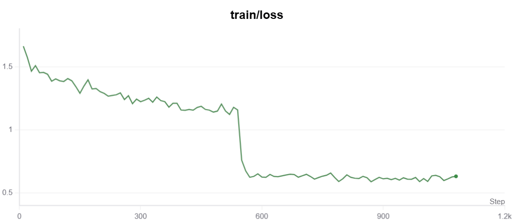

# 🩺 Qwen3-Medical-SFT

This project performs full-parameter fine-tuning of the [Qwen3-1.7B](https://modelscope.cn/models/Qwen/Qwen3-1.7B) large language model for medical dialogue. It supports professional medical Q&A with **Chain-of-Thought (CoT) reasoning**, and integrates [SwanLab](https://swanlab.cn) for training visualization.

> ⚠️ For research and educational purposes only. Not intended for medical use.

---

## 🔧 Project Structure

| File/Directory         | Description                                                            |
|------------------------|------------------------------------------------------------------------|
| `train.py`             | Fine-tune Qwen3-1.7B using Modelscope and Transformers                 |
| `inference.py`         | Run inference on a single medical query                                |
| `app.py`               | Gradio-based web UI for interactive medical Q&A                        |
| `train_format.jsonl`   | Reformatted training data (converted from raw JSONL dataset)           |

---

## 🧪 Usage Instructions

### 1. Install Dependencies

```bash
pip install swanlab modelscope==1.22.0 "transformers>=4.50.0" datasets==3.2.0 accelerate pandas addict gradio==4.44.1
```

Requirements:
- Python ≥ 3.8
- GPU with ≥ 32GB VRAM (recommended for full fine-tuning)

---

### 2. Prepare Dataset

We use [delicate_medical_r1_data](https://modelscope.cn/datasets/krisfu/delicate_medical_r1_data), a medical dialogue dataset. It has already been downloaded and split into training and validation sets.

Original format:

```json
{
  "question": "What should parents do when a child has a fever over 39°C?",
  "think": "The user asks about high fever in children. First, consider emergency measures...",
  "answer": "Apply physical cooling immediately and consult a doctor; ibuprofen may be used if needed."
}
```

Converted format used for training (via `dataset_jsonl_transfer` in `train.py`):

```json
{
  "instruction": "You are a medical expert...",
  "input": "What should parents do when a child has a fever over 39°C?",
  "output": "<think>...</think>\nAnswer content..."
}
```

---

### 3. Start Training

```bash
python train.py
```

- Model downloaded to `Qwen/Qwen3-1.7B/`
- Checkpoints saved in `./output/Qwen3-1.7B/checkpoint-*`
- Training logs visualized via SwanLab

---

### 4. Inference

```bash
python inference.py
```

---

### 5. Launch Web Demo

```bash
python app.py
```

A web interface will open (port `6006`) with sample medical queries.

---

## 📊 Visualization Results

Training loss curve:



> 💡 In our experiment, we observed a **step-wise decline in loss**, indicating signs of **overfitting**. Due to the limited size of the dataset, full fine-tuning is only suitable for **one epoch** of training to avoid degradation in performance.

---

## 🤖 Model Info

- Model: `Qwen/Qwen3-1.7B`
- Download: https://modelscope.cn/models/Qwen/Qwen3-1.7B
- Finetuning: Full-parameter
- Inference: Transformers + Gradio

---

## 📎 References

- [Qwen3 Official Page](https://modelscope.cn/models/Qwen)
- [SwanLab Visualization Tool](https://swanlab.cn)
- [HuggingFace Transformers](https://github.com/huggingface/transformers)

---

## 📄 License

MIT License